  

  
  
  
  

## Hello, I'm Weipeng 👋

I'm a PhD candidate in **Civil Engineering at [HKUST](https://hkust.edu.hk/)**, working on **differentiable physics** under the guidance of [Prof. Tianju Xue](https://scholar.google.com/citations?user=F2g2u0wAAAAJ).

I develop computational methods that connect physical modeling, numerical simulation, and gradient-based optimization. My current interests span nonlinear mechanics, inverse problems, scientific machine learning, and robotic systems.

## Research interests

  

## GitHub at a glance

  <picture>
    <source media="(prefers-color-scheme: dark)" srcset="https://github-readme-stats.vercel.app/api?username=xwpken&show_icons=true&hide_border=true&rank_icon=github&theme=github_dark&bg_color=00000000" />
    <source media="(prefers-color-scheme: light)" srcset="https://github-readme-stats.vercel.app/api?username=xwpken&show_icons=true&hide_border=true&rank_icon=github&theme=default&bg_color=00000000" />
    
  </picture>
  <picture>
    <source media="(prefers-color-scheme: dark)" srcset="https://github-readme-stats.vercel.app/api/top-langs/?username=xwpken&layout=compact&hide_border=true&theme=github_dark&bg_color=00000000" />
    <source media="(prefers-color-scheme: light)" srcset="https://github-readme-stats.vercel.app/api/top-langs/?username=xwpken&layout=compact&hide_border=true&theme=default&bg_color=00000000" />
    
  </picture>

## Let's connect

I'm always happy to discuss research, open-source scientific software, or potential collaborations.

  

  Turning physical insight into differentiable computation.

