  

  
  
  
  

## Hello, I'm Weipeng 👋

I'm a PhD candidate in Civil Engineering at [HKUST](https://hkust.edu.hk/), working on **differentiable physics** under the guidance of [Prof. Tianju Xue](https://scholar.google.com/citations?user=F2g2u0wAAAAJ). Learn more about my work on my [personal website](https://xwpken.github.io).

## Research interests

My current interests span nonlinear finite element analysis, differentiable programming, and inverse design and control. I am particularly interested in nonlinear and large-deformation analysis.

## GitHub at a glance

  <picture>
    <source media="(prefers-color-scheme: dark)" srcset="https://github-profile-summary-cards.vercel.app/api/cards/profile-details?username=xwpken&theme=github_dark" />
    <source media="(prefers-color-scheme: light)" srcset="https://github-profile-summary-cards.vercel.app/api/cards/profile-details?username=xwpken&theme=github" />
    
  </picture>
  <picture>
    <source media="(prefers-color-scheme: dark)" srcset="https://github-profile-summary-cards.vercel.app/api/cards/stats?username=xwpken&theme=github_dark" />
    <source media="(prefers-color-scheme: light)" srcset="https://github-profile-summary-cards.vercel.app/api/cards/stats?username=xwpken&theme=github" />
    
  </picture>

## Let's connect

I'm always happy to discuss research, open-source scientific software, or potential collaborations.

  

